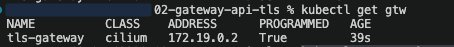

# TLS Enabling and Termination at Gateway API

## Step:1 Generate TLS Certificate
```bash
openssl req -x509 -nodes -days 365 -newkey rsa:2048 \
  -keyout tls.key -out tls.crt -subj "/CN=claybrainer.lab"
```

## Step:2 Create Secret to host this Crt and Key. 
This will be used by our Gateway API to validate the https Request and terminate the https request. 
`kubectl create secret tls claybrainer-tls --key tls.key --cert tls.crt`

## Step:3 Deploy an app
`kubectl run web-a -n site-a --expose --port=5678 --image=hashicorp/http-echo -- -text="Welcome to Site A"`

## Step:4 Configure Gateway
- To create Gateway using cilium
`kubectl create -f gateway.yaml`
- Makesure `PROGRAMMED` is set to `True` and `ADDRESS` have value
- Example


## Step:5 Configure HTTP Route for your application
`kubectl apply -f httproute.yaml`

## Step:6 For Kind use below url to test the app
`curl -kv --resolve claybrainer.lab:443:172.19.0.2 https://claybrainer.lab/weba`

### To Test it on Browser
- Open host file`sudo vim /etc/hosts`
- Enter the below line at the end `172.19.0.2  claybrainer.lab`. Save it
- Then use this url in browser `https://claybrainer.lab/weba`


# TroubleShooting steps
## Control Plane Verification (Resource Status)
Before digging into underlying container logs, inspect the Gateway API native object statuses to determine exactly where the configuration pipeline is stalling.

### Verify HTTPRoute Binding Status
- Check if the route is successfully accepted and programmed by the parent Gateway:
`kubectl get httproute web-a-route -n site-a -o yaml`
- Look for the status.parents array. You must see both conditions set to True:

```yaml
status:
  parents:
  - conditions:
    - reason: Accepted
      status: "True"
      type: Accepted
    - reason: Programmed
      status: "True"
      type: ResolvedRefs
```

### Verify Gateway Certificate Resolution Status
- Check if Cilium successfully resolved your referenced TLS secret (claybrainer-tls):
- `kubectl get gateway tls-gateway -n default -o yaml`
- Look at the `status.listeners` conditions block:
```yaml
status:
  listeners:
  - name: https
    conditions:
    - reason: ResolvedRefs
      status: "True"      # True = Secret found and validated
      type: ResolvedRefs
    - reason: Programmed
      status: "True"      # True = Translation to Envoy config succeeded
      type: Programmed
```
## Deep-Dive Log Validation
- If statuses look correct but connections still fail, inspect Cilium's internal controllers step-by-step.

### A. Validating via Cilium Operator Logs
The `cilium-operator` acts as the control-plane brain for the Gateway API. It watches Gateway resources, validates referenced TLS secrets, and constructs the lower-level proxy requirements.
- Locate the running operator pods: 
```bash
kubectl get pods -n kube-system -l app.kubernetes.io name=cilium-operator
```
- Stream logs filtered specifically for your Gateway or Secret name:
```bash
kubectl logs -n kube-system deployment/cilium-operator --tail=200 | grep -E "gateway|tls-gateway|claybrainer"
```
- What to look for:

    - Success: Look for reconciliation logs parsing your Gateway listeners.
    - Failure indicators: Look for errors stating `Secret not found, RBAC permission denied to read secret`, or blockages regarding `AllowedRoutes` limitations.

### B. Validating via Cilium Envoy Logs
- Find your active Envoy or Agent pods: `kubectl get pods -n kube-system -l app.kubernetes.io/name=cilium-envoy`
- Monitor real-time logs while initiating a curl request: `kubectl logs -n kube-system deployment/cilium-envoy -f`
- What to look for: 
    - Look for SDS (Secret Discovery Service) log lines indicating successful updates: `[debug][upstream] [source/common/secret/sds_api.go:85] SDS config update successful for claybrainer-tls`
- If the certificate is missing or invalid, Envoy will log downstream TLS exceptions: `[warning][config] [source/server/config_validation/api.go:30] TLS error: Secret 'default/claybrainer-tls' is not ready.`

## Inspecting Runtime Envoy Configuration Directly
- To confirm beyond doubt that Envoy has compiled your configuration and loaded your specific TLS certificate into memory, run a live config dump query.

- Extracting Live TLS Secrets from Envoy Run the following administrative execution command to view the live memory secrets structure inside Envoy:
- `kubectl exec -it deployment/cilium-envoy -n kube-system -- cilium-envoy-admin-client config_dump | grep -A 10 -B 2 "claybrainer"`
- (For alternative/legacy Cilium deployments, extract via the agent binary directly: `kubectl exec -it <cilium-agent-pod-name> -n kube-system -- cilium-dbg envoy secrets`)
- Expected output signature block:
```json
{
 "name": "default/claybrainer-tls",
 "tls_certificate": {
  "certificate_chain": {
   "inline_string": "-----BEGIN CERTIFICATE-----\\nMII..."
  }
 }
}
```