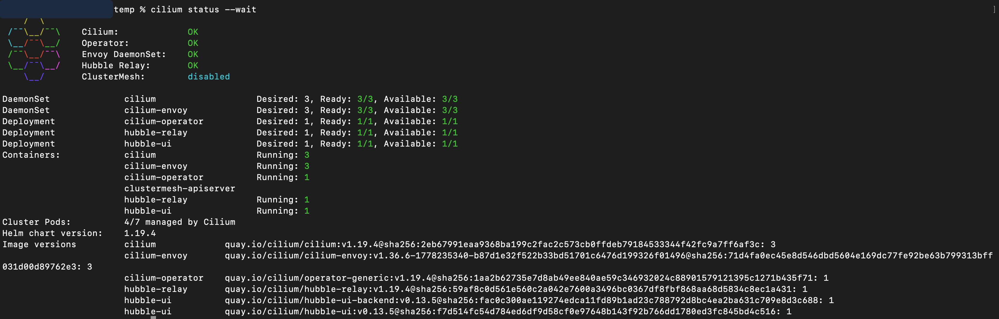

# Cilium
In this section, we will learn and practice the end-to-end working of Cilium in a Kubernetes cluster.

# Cilium Setup

In this section we will configure the local Kubernetes cluster to use Cilium as the CNI.

The setup in this repository enables:

- Cilium `v1.19.4`
- kube-proxy replacement
- Gateway API support
- Hubble relay and Hubble UI

## Prerequisites

Before installing Cilium, make sure you already have:

- a running local Kind cluster
- Docker
- kubectl
- the Cilium CLI

> [!IMPORTANT]
> If you have not created the local Kind cluster yet, follow the guide in [setup-local-cluster/Readme.md](../../setup-local-cluster/Readme.md) before continuing.

This Cilium guide assumes your Kind cluster name is `demo-lab01`, because the install command reads the IP of the `demo-lab01-control-plane` container.

## Install The Cilium CLI

Use the official Cilium CLI installation guide for macOS, Linux, and Windows:

- https://docs.cilium.io/en/stable/gettingstarted/k8s-install-default/
- https://github.com/cilium/cilium-cli

Verify the CLI is available:

```bash
cilium version
```

## Optional: Pre-Pull Images

If your system or network is slow, you can pull the required images before installation:

```bash
docker pull quay.io/cilium/cilium:v1.19.4

docker pull quay.io/cilium/operator-generic:v1.19.4

docker pull quay.io/cilium/cilium-envoy:v1.36.6-1778235340-b87d1e32f522b33bd51701c6476d199326f01496
```

## Confirm The Kubernetes Context

Make sure `kubectl` is pointing to the Kind cluster you want to configure:

```bash
kubectl config current-context
kubectl config use-context kind-demo-lab01
```

You can confirm the cluster is reachable with:

```bash
kubectl get nodes
```

## Notes

- `v1.19.4` was the stable Cilium release used when this repository content was created.
- The `k8sServiceHost` value is read from the Kind control-plane container IP so Cilium can connect to the Kubernetes API server correctly in this local setup.
- Gateway API and Hubble are enabled during installation because later sections in this repository depend on those features.


## Install Required CRDs
- Before running that install command, verify that the Kubernetes Gateway API CRDs (Custom Resource Definitions) are installed.
```bash
kubectl apply -f https://github.com/kubernetes-sigs/gateway-api/releases/download/v1.1.0/standard-install.yam
```

## Install Cilium

Run the following command to install Cilium:

```bash
cilium install \
  --version 1.19.4 \
  --set kubeProxyReplacement=true \
  --set k8sServiceHost=$(docker inspect demo-lab01-control-plane -f '{{range .NetworkSettings.Networks}}{{.IPAddress}}{{end}}') \
  --set k8sServicePort=6443 \
  --set gatewayAPI.enabled=true \
  --set hubble.enabled=true \
  --set hubble.relay.enabled=true \
  --set hubble.ui.enabled=true
```

Configuration used in this install:

- `--version 1.19.4`: Installs a known Cilium release. We pin the version so the lab remains repeatable and does not change behavior when newer releases appear.
- `--set kubeProxyReplacement=true`: Tells Cilium to replace kube-proxy and handle Kubernetes service load-balancing itself. This is enabled so you can practice Cilium's eBPF-based datapath instead of the traditional kube-proxy model.
- `--set k8sServiceHost=$(docker inspect demo-lab01-control-plane ...)`: Points Cilium to the Kubernetes API server address exposed by the Kind control-plane container. This is required in this local Kind-based setup so Cilium can reliably reach the API server.
- `--set k8sServicePort=6443`: Sets the Kubernetes API server port. This is enabled because `6443` is the standard secure API server port used by Kind.
- `--set gatewayAPI.enabled=true`: Enables Gateway API support in Cilium. This is turned on because later networking exercises in this repository depend on Gateway API resources.
- `--set hubble.enabled=true`: Enables Hubble, which provides network observability for Cilium. This is useful for learning how traffic flows through the cluster.
- `--set hubble.relay.enabled=true`: Enables Hubble Relay so observability data can be queried centrally. This is needed for a smoother Hubble experience across the cluster.
- `--set hubble.ui.enabled=true`: Enables the Hubble UI. This is useful when you want a visual interface to inspect service communication and traffic flows.

## Validate The Installation

Wait for the installation to complete:

```bash
cilium status --wait
```

You can also inspect the system pods:

```bash
kubectl get all -n kube-system
```

To watch the rollout continuously:

```bash
watch kubectl get all -n kube-system
```

Make sure all Cilium components are up and running before moving to the next section.

Reference status screenshot:

